<div align="center">

# APR Xàtiva — App Android

**Aplicación Android para usuarios del sistema de control de acceso vehicular**

[](https://kotlinlang.org)
[](https://developer.android.com/jetpack/compose)
[](https://android.com)

</div>

---

## ¿Qué es APR Xàtiva?

APR Xàtiva es un sistema de control de acceso vehicular desarrollado como Trabajo de Fin de Grado (DAM) y adoptado por el Ajuntament de Xàtiva como propuesta técnica. Este repositorio contiene la app Android para los usuarios — permite solicitar autorización de acceso, gestionar vehículos y consultar derechos de acceso desde el móvil.

🔧 **Backend:** [github.com/ArocaDev/apr-xativa-backend](https://github.com/ArocaDev/apr-xativa-backend)  
🌐 **Panel web:** [github.com/ArocaDev/apr-xativa-frontend](https://github.com/ArocaDev/apr-xativa-frontend)

---

## ✨ Funcionalidades

- **Login y registro** con JWT y renovación automática de token
- **Envío de documentación** — el usuario adjunta un justificante de residencia, trabajo o vinculación con el núcleo antiguo para solicitar autorización
- **Estado de solicitud** en tiempo real — la app refleja el cambio sin recargar cuando el administrador aprueba o rechaza
- **Gestión de vehículos** — añadir y eliminar matrículas autorizadas
- **Derechos de acceso** — consulta de accesos permanentes y solicitud de accesos puntuales para invitados (límite 5/mes)
- **Guía de uso** — onboarding para nuevos usuarios
- **Perfil de usuario**
- **Modo oscuro**
- **Multiidioma** — Valenciano, Español e Inglés
- **Visibilidad de contraseña** en login y registro
- **Compatibilidad** Android 8.0+

---

## 📸 Capturas

<div align="center">

| Login | Registro | Sin documentación | Con documentación |
|:-:|:-:|:-:|:-:|
| 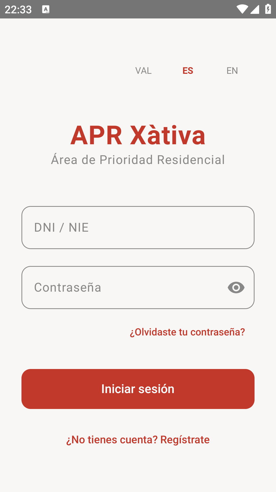 | 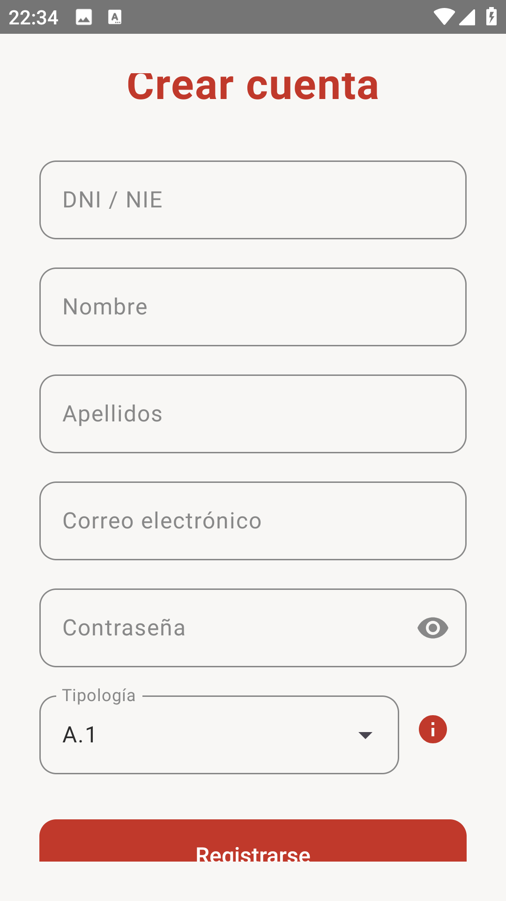 | 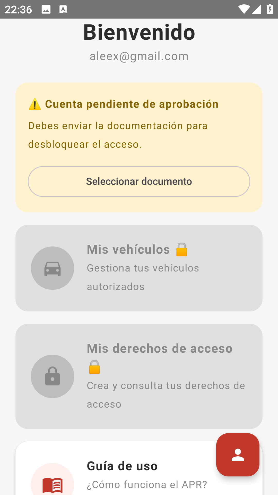 | 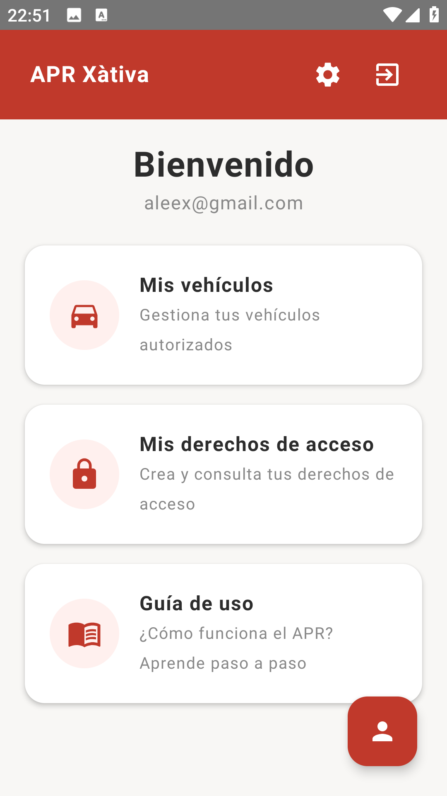 |

| Guía de uso | Mis vehículos | Derechos de acceso | Perfil |
|:-:|:-:|:-:|:-:|
| 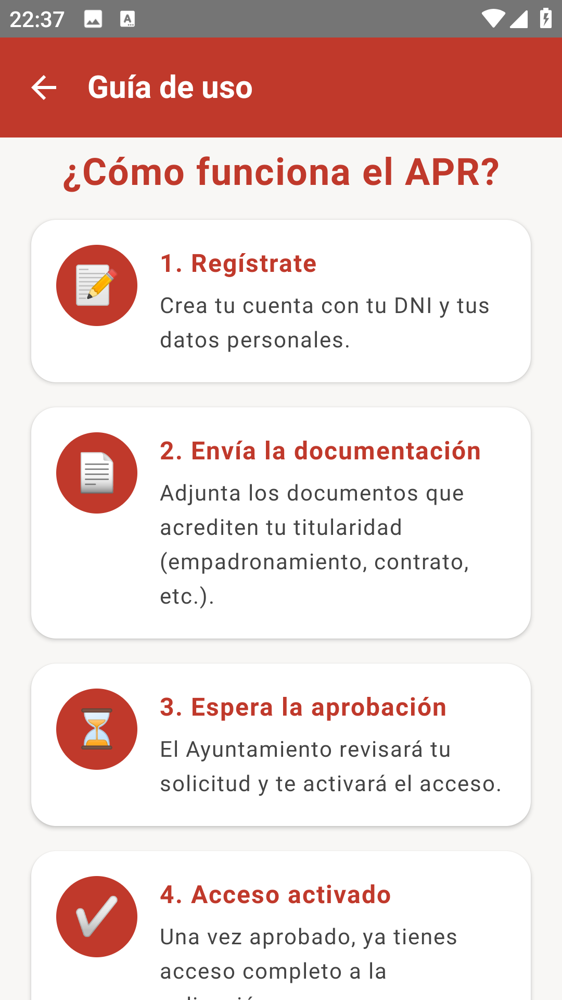 | 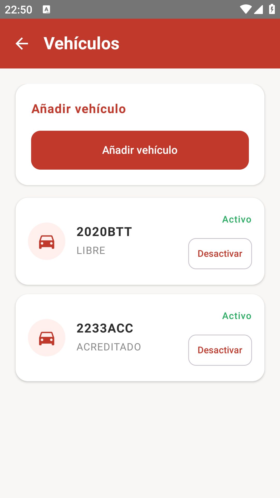 | 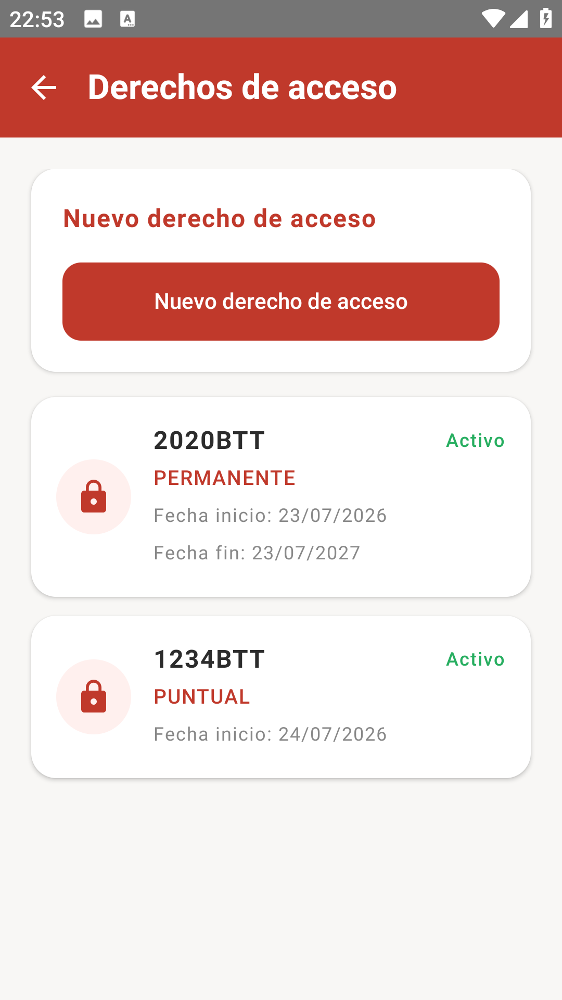 | 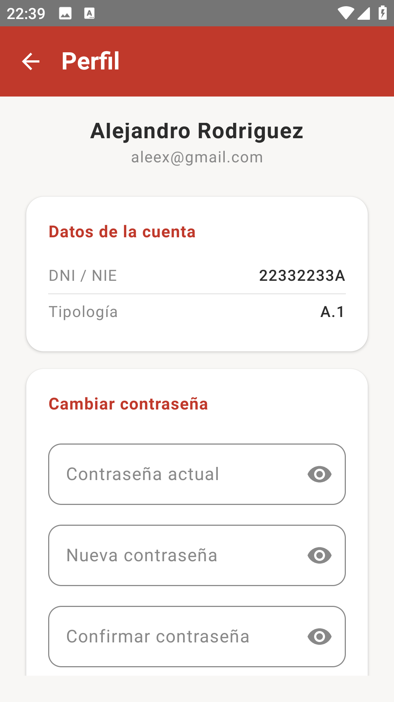 |

</div>

---

## 🎬 Demo

<div align="center">

**Aprobación de solicitud**

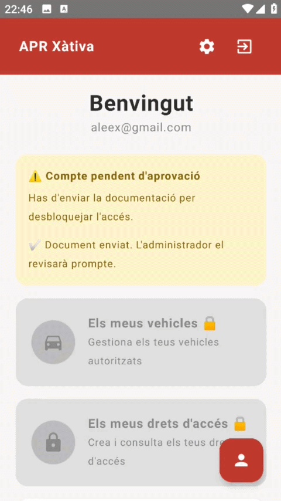

**Guía de uso**

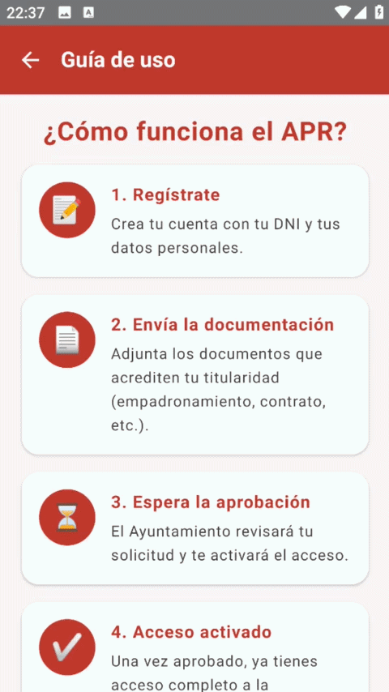

**Gestión de vehículos**

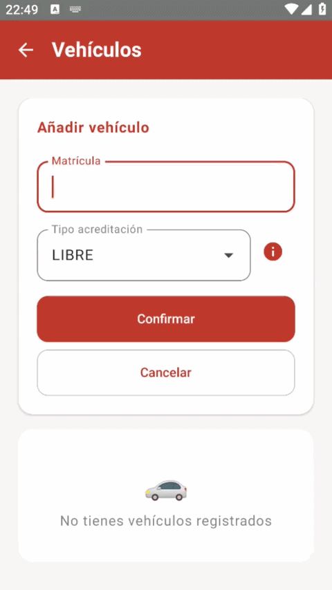

**Derechos de acceso**

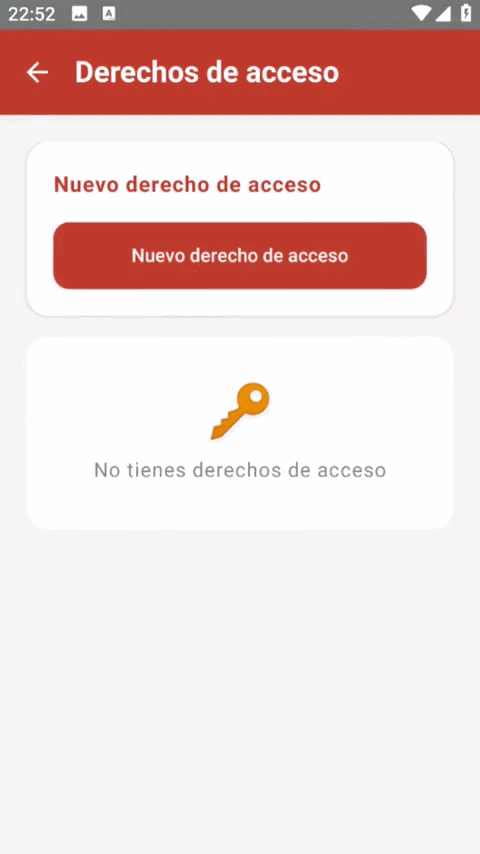

</div>

---

## 🛠️ Stack técnico

| Capa | Tecnología |
|------|-----------|
| Lenguaje | Kotlin 2.0 |
| UI | Jetpack Compose |
| Arquitectura | MVVM |
| HTTP | Retrofit 2 |
| Auth | JWT con interceptor automático |
| Navegación | Navigation Compose |
| Mínimo SDK | Android 8.0 (API 26) |

---

## 📁 Estructura del proyecto

```
apr-xativa-android/
├── app/src/main/java/com/arocadev/aprxativa/
│   ├── ui/
│   │   ├── login/
│   │   ├── registro/
│   │   ├── home/
│   │   ├── vehiculos/
│   │   ├── derechos/
│   │   ├── perfil/
│   │   └── guia/
│   ├── data/
│   │   ├── api/
│   │   ├── model/
│   │   └── repository/
│   └── MainActivity.kt
├── assets/
│   └── .gitkeep
└── build.gradle.kts
```

---

## 🚀 Instalación

### Desde el código fuente

```bash
git clone https://github.com/ArocaDev/apr-xativa-android.git
```

1. Abre el proyecto en Android Studio
2. Edita la URL del backend en `app/src/main/res/values/config.xml`
3. Ejecuta en emulador o dispositivo físico

### APK directa

Descarga la última versión desde [Releases](https://github.com/ArocaDev/apr-xativa-android/releases).

---

## 🌍 Idiomas soportados

| Idioma | Código |
|--------|--------|
| Valenciano | `ca` |
| Español | `es` |
| Inglés | `en` |

---

## 🗺️ Roadmap

- [x] Login y registro con JWT
- [x] Envío de documentación para solicitud de acceso
- [x] Estado de solicitud en tiempo real
- [x] Gestión de vehículos
- [x] Derechos de acceso permanentes y puntuales
- [x] Guía de onboarding
- [x] Perfil de usuario
- [x] Modo oscuro
- [x] Multiidioma (Valenciano / Español / Inglés)
- [x] Visibilidad de contraseña
- [ ] Pull to refresh
- [ ] Mejora de gestión de estados de carga
- [x] APK en GitHub Releases

---

## 🏆 Reconocimiento

Proyecto calificado con **10/10** y adoptado por el **Ajuntament de Xàtiva** como propuesta técnica oficial.

---

## 👤 Autor

**Alejandro Rodríguez Calabuig**  
[github.com/ArocaDev](https://github.com/ArocaDev) · [LinkedIn](https://www.linkedin.com/in/alejandro-rodriguez-calabuig-a871a1230)

---

## 📄 Licencia

Proyecto académico — no licenciado para uso comercial.
